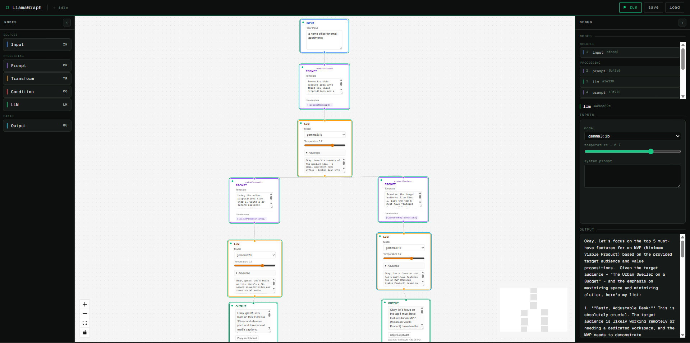

<div align="center">


**Your AI. Your machine. Your rules.**

 
 
 
 




</div>

<p align="center">
  <strong>An open-source, no-code AI workflow builder for local LLMs.</strong> Drag nodes onto a canvas, wire them into prompt chains or branching pipelines, and run them against any Ollama model — fully local, no API keys, no data ever leaving your machine.
</p>
<p align="center">
  ⭐️ If you like this project, please <a href="https://github.com/dakshp26/llamagraph">star the repo on GitHub</a>! Your support helps more people discover and improve this open source project.
</p>

---

## Quick Start

**Prerequisites:**
- [Docker Desktop](https://www.docker.com/products/docker-desktop)
- [Ollama](https://ollama.com/) running locally with at least one model pulled. llama3 is used as an example here ([pull any model available on Ollama!](https://ollama.com/library))

```bash
ollama pull llama3
```

**Run with Docker:**
```bash
git clone https://github.com/dakshp26/llamagraph
cd llamagraph
docker compose up --build
```

Open [http://localhost:3000](http://localhost:3000).

LlamaGraph is intended for local use. Docker binds the frontend and backend
to `127.0.0.1` only; do not expose these ports to your LAN or the public
internet without separate authentication and network protection.

<details>
<summary>Manual setup (for development)</summary>

**Prerequisites:** Node.js 20+, pnpm, [uv](https://docs.astral.sh/uv/getting-started/#installation) (installs a compatible Python if needed), Ollama running locally.

```bash
# 1. Clone and install JS deps
git clone https://github.com/dakshp26/llamagraph
cd llamagraph
pnpm install

# 2. Set up the backend with uv (creates .venv/ from pyproject.toml + uv.lock)
cd backend
uv sync --all-groups   # app deps + dev (pytest, ruff, httpx)

# 3. Start everything
cd ..
pnpm dev
```

The backend venv is created under `backend/.venv` so the root `pnpm dev` script can find Python. You can also run tools without activating the venv, for example: `cd backend && uv run ruff check` or `uv run pytest`.

Frontend runs on [http://localhost:3000](http://localhost:3000), backend on [http://localhost:8000](http://localhost:8000).
Keep both services local-only unless you add separate protection such as
authentication, firewall rules, or a private tunnel.

</details>

---

## What it does

LlamaGraph gives you a node-based canvas to design, connect, and run AI workflows of any complexity — from a single prompt-to-output chain to multi-branch pipelines with conditional routing, data transformation, and chained LLM calls.

Each run streams execution updates in real time via Server-Sent Events: you see each node's status and output as it happens, not after the whole pipeline finishes.

**Use it to:**
- Prototype complex prompt chains without writing code
- Build conditional AI workflows that branch on LLM output
- Chain multiple LLM calls with intermediate transformations
- Test and iterate on pipelines visually before committing to code
- Save and load pipeline configurations as portable `.llamagraph.json` files (see [examples](examples/))

## Why LlamaGraph?

Most local LLM tools give you a chat window. Most pipeline tools require writing code or sending your data to the cloud. LlamaGraph sits in between: a visual, code-free builder that runs entirely on your machine.

- **Private by design** — no external API calls, no telemetry, no data leaving your machine
- **Visual, not verbal** — build multi-step logic without prompting your way through it
- **Real-time feedback** — watch each node execute and stream output as it happens
- **Composable** — mix prompts, transforms, conditions, and multiple LLM calls in one graph
- **Portable** — pipelines are plain JSON; version them, share them, load them anywhere

## Node types

Nodes are composable: connect them in any order the DAG allows, fan out to parallel branches, or converge multiple streams into one.

### Sources

Source nodes produce data. Every pipeline needs at least one. They have no required upstream connections.

<details>
<summary><strong>Input</strong> — entry point, feeds text or data into the pipeline</summary>

The Input node is where every pipeline begins. You type (or paste) a value directly into the node; that value becomes the root output that downstream nodes receive.

- Accepts any free-form text — a question, a document, a JSON snippet, a list
- A pipeline can have multiple Input nodes to feed independent branches
- No upstream connections are allowed; Input nodes are always sources, never sinks
- The value is stored in the saved `.llamagraph.json` file so pipelines are self-contained and replayable

</details>

<details>
<summary><strong>JSON API</strong> — fetches data from an external HTTP endpoint</summary>

The JSON API node makes a GET request to any public HTTP/HTTPS URL and passes the response body downstream as text. Use it to pull live data — REST APIs, JSON feeds, public datasets — into your pipeline before processing it with a Prompt or Transform node.

- Enter a URL directly, or use `{{handle}}` placeholders to inject values from upstream nodes (e.g. `https://api.example.com/posts/{{post_id}}`)
- Add any number of key/value **query params** and **headers** — placeholders work in those fields too
- The full response body (up to 500 KB) is passed downstream; pair it with a Transform node to extract a specific field before feeding it to an LLM
- Requests to private or internal addresses (`192.168.x.x`, `10.x.x.x`, `169.254.x.x`, `localhost`) are blocked to prevent accidental internal network access
- A live `curl` preview updates as you type so you can verify the exact request before running

See [`examples/json_api_example.llamagraph.json`](examples/json_api_example.llamagraph.json) for a working pipeline that fetches a post from a public API, extracts its body field, and has an LLM translate it.

</details>

### Processing

Processing nodes transform or route data. Most require at least one upstream connection — Prompt nodes only require one if the template contains a `{{placeholder}}`.

<details>
<summary><strong>Prompt</strong> — Jinja-style template that injects upstream values into a prompt</summary>

The Prompt node assembles a final prompt string by interpolating values from connected upstream nodes into a template. It is the primary way to craft LLM instructions dynamically.

- Uses `{{ variable_name }}` syntax (Jinja2-style) to reference upstream node outputs by name
- Multiple upstream nodes can be referenced in a single template
- Supports multi-line templates — useful for system prompts, few-shot examples, or structured instructions
- The rendered string is passed downstream as-is; connect it to an LLM node to execute it, or to a Transform node for further processing
- Template rendering happens on the backend so the final prompt is never partially sent

</details>

<details>
<summary><strong>Transform</strong> — regex or field-extract operations on text</summary>

The Transform node manipulates text before or after an LLM call without invoking a model. It is useful for cleaning output, extracting structured values, or reshaping data for the next stage.

- **Regex extract** — applies a regular expression and emits the first capture group (or the full match)
- **Field extract** — parses key-value output (e.g. `Label: value`) and pulls out a named field
- Operates entirely on the backend — no model call, no latency beyond string processing
- Can be chained: run a Transform after an LLM node to normalize its output before feeding it into a Condition or another LLM node

</details>

<details>
<summary><strong>Condition</strong> — branches the graph based on a rule, true/false routing</summary>

The Condition node evaluates its upstream input against a rule and routes execution down either a **true** branch or a **false** branch. Branches that are not taken are marked as skipped — their nodes are bypassed entirely rather than receiving empty input.

- Rules are simple string comparisons: `equals`, `contains`, `starts with`, `ends with`, or `matches regex`
- Each Condition node has exactly two outgoing edges, labelled `true` and `false`
- Skipped branches are visible in the UI with a distinct status so you can see exactly which path was taken
- Conditions can be nested: the output of one branch can feed another Condition node for multi-level routing
- The executor tracks skipped node IDs and propagates the skip state through all transitive dependents

</details>

### Intelligence

Intelligence nodes invoke a local language model. They require at least one upstream connection providing the prompt text.

<details>
<summary><strong>LLM</strong> — calls a local Ollama model and streams the response</summary>

The LLM node sends its upstream input to a locally running Ollama model and streams the response token by token back to the frontend via Server-Sent Events.

- Select any model that Ollama has pulled (`ollama pull <model>`) — the node lists available models at runtime
- Streaming is incremental: tokens appear in the UI as they are generated, not after the full response finishes
- The backend wraps the Ollama HTTP API; the frontend never calls Ollama directly
- LLM nodes can be chained — pipe one model's output into a Prompt node, then into a second LLM node for multi-stage reasoning
- If Ollama is unreachable, the node surfaces a clear error rather than hanging

</details>

### Output

<details>
<summary><strong>Output</strong> — terminal node, displays final results</summary>

The Output node is the sink of the pipeline. It receives the final value from its upstream node and renders it in the canvas panel.

- A pipeline can have multiple Output nodes — useful when parallel branches each produce a result
- The displayed value is the raw string passed by the upstream node (LLM response, transformed text, etc.)
- Output nodes have no outgoing edges; they are always leaves in the DAG
- Results persist in the UI until the next run so you can inspect and copy them after execution completes

</details>

---

## Project structure

```
llamagraph/
├── frontend/
│   ├── app/           # Next.js App Router pages
│   ├── components/    # canvas/, nodes/, debug/, ui/
│   ├── store/         # Zustand: pipelineStore, executionStore, validationStore
│   └── lib/           # sseClient, pipelineFile, API client, graph utils
├── backend/
│   ├── routers/       # FastAPI route handlers
│   ├── services/      # graph.py, executor.py, node_handlers.py, ollama_client.py
│   └── models/        # Pydantic schemas
├── examples/          # Sample .llamagraph.json pipelines
└── docker-compose.yml
```

## Architecture

The UI continuously polls `POST /pipeline/validate` and surfaces errors in real time. On run, `POST /pipeline/run` validates and topologically sorts the DAG, then executes nodes one by one — skipping branches marked unreachable by condition nodes. LLM nodes stream tokens back via SSE; the frontend never calls Ollama directly.

**API:**
| Method | Path | Purpose |
|--------|------|---------|
| `GET` | `/ollama/health` | Ollama connectivity check |
| `GET` | `/ollama/models` | Available model list |
| `POST` | `/pipeline/validate` | Graph validation |
| `POST` | `/pipeline/run` | Pipeline execution — SSE stream |

## Tech stack

| | |
|---|---|
| **Frontend** | Next.js 16, React 19, XYFlow, Zustand, Tailwind CSS 4 |
| **Backend** | Python 3.11, FastAPI, Uvicorn, Ollama, [uv](https://docs.astral.sh/uv/) (package manager) |

## Contributing

Contributions are welcome — bug fixes, new node types, UI improvements, docs.

1. **Open an issue first** for anything beyond a small fix so we can align on direction before you invest time.
2. Fork the repo and create a feature branch.
3. Make your changes and add tests where applicable.
4. Open a PR with a clear description of what changed and why.

```bash
# Lint and test before opening a PR
pnpm --filter frontend lint
pnpm --filter frontend build

cd backend
uv run ruff check
uv run pytest
```

**Good first issues:** look for the `good first issue` label in the issue tracker.

## License

MIT — see [LICENSE](LICENSE).
